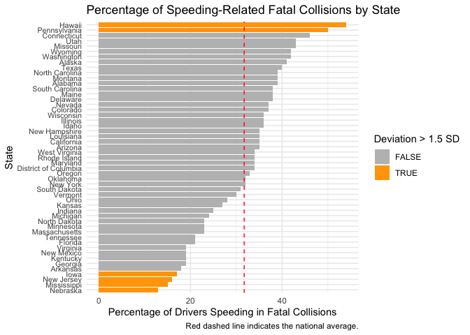
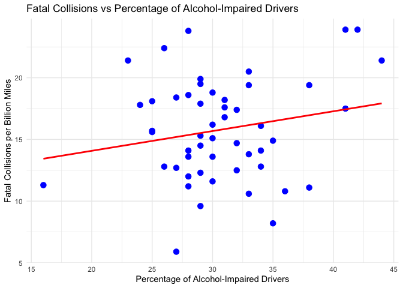
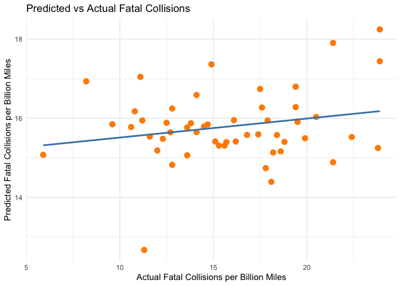

# Analysis on Bad Drivers in the United States

#### Eitan Tuchin, Tirmidi Mohamed

## Introduction

The goal of our project is to explore data about bad drivers in the
United States so that we can better understand causes of fatal car
crashes and point out common characteristics about bad drivers. Since
driving is such a common activity that we as humans do on a day-to-day
basis it becomes imperative to analyze times at when driving has gone
wrong in the name of trying to reduce the risk for these dangerous
situations. We hope that our exploration and the analysis of the data we
looked at will lead to more effective driving policies throughout
America and an altogether smaller fatalities reported in later data.

To achieve our project’s goal we will answer the following questions:

1.  Can we identify regional patterns in bad driving behaviors like
    speeding and alcohol impairment, and how do these align with fatal
    collision rates?

2.  Are there states where the percentage of speeding-related fatal
    collisions significantly deviates from the national average, and
    what state-specific factors might explain this?

3.  How well can a predictive model use percentages of speeding, alcohol
    impairment, and distraction to estimate fatal collisions per billion
    miles, and which factor is most influential?

These will be the main questions that we try and answer throughout our
work on this project. We hope to get to some meaningful conclusions
about bad drivers and their common trends in the United States.

## Data

### Structure

The link to our dataset is
<https://github.com/fivethirtyeight/data/blob/master/bad-drivers/bad-drivers.csv>.
The github link points to a csv file under a repository. Our dataset
contains varying statistics relating to specifically bad-drivers
throughout the United States including the District of Columbia. For
each state (row) there are 7 columns that contain statistics like
percentage of drivers involved in fatal collisions who were impaired by
alcohol use. Each metric is numerical, either being an int or a float.
Most deal with the “number of” or “percentage of” drivers in that state.

Overall our dataset is pretty simple and it contains all of the data we
need for answering our questions.

### Cleaning

The first thing we need to do is read in the csv file and take a look at
it:

``` r
data <- read.csv("bad-drivers.csv")
summary(data)
```

    ##     State          
    ##  Length:51         
    ##  Class :character  
    ##  Mode  :character  
    ##                    
    ##                    
    ##                    
    ##  Number.of.drivers.involved.in.fatal.collisions.per.billion.miles
    ##  Min.   : 5.90                                                   
    ##  1st Qu.:12.75                                                   
    ##  Median :15.60                                                   
    ##  Mean   :15.79                                                   
    ##  3rd Qu.:18.50                                                   
    ##  Max.   :23.90                                                   
    ##  Percentage.Of.Drivers.Involved.In.Fatal.Collisions.Who.Were.Speeding
    ##  Min.   :13.00                                                       
    ##  1st Qu.:23.00                                                       
    ##  Median :34.00                                                       
    ##  Mean   :31.73                                                       
    ##  3rd Qu.:38.00                                                       
    ##  Max.   :54.00                                                       
    ##  Percentage.Of.Drivers.Involved.In.Fatal.Collisions.Who.Were.Alcohol.Impaired
    ##  Min.   :16.00                                                               
    ##  1st Qu.:28.00                                                               
    ##  Median :30.00                                                               
    ##  Mean   :30.69                                                               
    ##  3rd Qu.:33.00                                                               
    ##  Max.   :44.00                                                               
    ##  Percentage.Of.Drivers.Involved.In.Fatal.Collisions.Who.Were.Not.Distracted
    ##  Min.   : 10.00                                                            
    ##  1st Qu.: 83.00                                                            
    ##  Median : 88.00                                                            
    ##  Mean   : 85.92                                                            
    ##  3rd Qu.: 95.00                                                            
    ##  Max.   :100.00                                                            
    ##  Percentage.Of.Drivers.Involved.In.Fatal.Collisions.Who.Had.Not.Been.Involved.In.Any.Previous.Accidents
    ##  Min.   : 76.00                                                                                        
    ##  1st Qu.: 83.50                                                                                        
    ##  Median : 88.00                                                                                        
    ##  Mean   : 88.73                                                                                        
    ##  3rd Qu.: 95.00                                                                                        
    ##  Max.   :100.00                                                                                        
    ##  Car.Insurance.Premiums....
    ##  Min.   : 642.0            
    ##  1st Qu.: 768.4            
    ##  Median : 859.0            
    ##  Mean   : 887.0            
    ##  3rd Qu.:1007.9            
    ##  Max.   :1301.5            
    ##  Losses.incurred.by.insurance.companies.for.collisions.per.insured.driver....
    ##  Min.   : 82.75                                                              
    ##  1st Qu.:114.64                                                              
    ##  Median :136.05                                                              
    ##  Mean   :134.49                                                              
    ##  3rd Qu.:151.87                                                              
    ##  Max.   :194.78

``` r
head(data)
```

    ##        State Number.of.drivers.involved.in.fatal.collisions.per.billion.miles
    ## 1    Alabama                                                             18.8
    ## 2     Alaska                                                             18.1
    ## 3    Arizona                                                             18.6
    ## 4   Arkansas                                                             22.4
    ## 5 California                                                             12.0
    ## 6   Colorado                                                             13.6
    ##   Percentage.Of.Drivers.Involved.In.Fatal.Collisions.Who.Were.Speeding
    ## 1                                                                   39
    ## 2                                                                   41
    ## 3                                                                   35
    ## 4                                                                   18
    ## 5                                                                   35
    ## 6                                                                   37
    ##   Percentage.Of.Drivers.Involved.In.Fatal.Collisions.Who.Were.Alcohol.Impaired
    ## 1                                                                           30
    ## 2                                                                           25
    ## 3                                                                           28
    ## 4                                                                           26
    ## 5                                                                           28
    ## 6                                                                           28
    ##   Percentage.Of.Drivers.Involved.In.Fatal.Collisions.Who.Were.Not.Distracted
    ## 1                                                                         96
    ## 2                                                                         90
    ## 3                                                                         84
    ## 4                                                                         94
    ## 5                                                                         91
    ## 6                                                                         79
    ##   Percentage.Of.Drivers.Involved.In.Fatal.Collisions.Who.Had.Not.Been.Involved.In.Any.Previous.Accidents
    ## 1                                                                                                     80
    ## 2                                                                                                     94
    ## 3                                                                                                     96
    ## 4                                                                                                     95
    ## 5                                                                                                     89
    ## 6                                                                                                     95
    ##   Car.Insurance.Premiums....
    ## 1                     784.55
    ## 2                    1053.48
    ## 3                     899.47
    ## 4                     827.34
    ## 5                     878.41
    ## 6                     835.50
    ##   Losses.incurred.by.insurance.companies.for.collisions.per.insured.driver....
    ## 1                                                                       145.08
    ## 2                                                                       133.93
    ## 3                                                                       110.35
    ## 4                                                                       142.39
    ## 5                                                                       165.63
    ## 6                                                                       139.91

The first thing we did cleaning wise was check for missing values in our
data by iterating over every column in our data and checking if the
value was NA or not. Then we removed any columns with missing values.

``` r
missing_values <- colSums(is.na(data))
print("Missing values per column:")
```

    ## [1] "Missing values per column:"

``` r
print(missing_values)
```

    ##                                                                                                  State 
    ##                                                                                                      0 
    ##                                       Number.of.drivers.involved.in.fatal.collisions.per.billion.miles 
    ##                                                                                                      0 
    ##                                   Percentage.Of.Drivers.Involved.In.Fatal.Collisions.Who.Were.Speeding 
    ##                                                                                                      0 
    ##                           Percentage.Of.Drivers.Involved.In.Fatal.Collisions.Who.Were.Alcohol.Impaired 
    ##                                                                                                      0 
    ##                             Percentage.Of.Drivers.Involved.In.Fatal.Collisions.Who.Were.Not.Distracted 
    ##                                                                                                      0 
    ## Percentage.Of.Drivers.Involved.In.Fatal.Collisions.Who.Had.Not.Been.Involved.In.Any.Previous.Accidents 
    ##                                                                                                      0 
    ##                                                                             Car.Insurance.Premiums.... 
    ##                                                                                                      0 
    ##                           Losses.incurred.by.insurance.companies.for.collisions.per.insured.driver.... 
    ##                                                                                                      0

``` r
data <- data[, colSums(is.na(data)) == 0]  
print("Columns after removing those with NAs:")
```

    ## [1] "Columns after removing those with NAs:"

``` r
print(names(data))
```

    ## [1] "State"                                                                                                 
    ## [2] "Number.of.drivers.involved.in.fatal.collisions.per.billion.miles"                                      
    ## [3] "Percentage.Of.Drivers.Involved.In.Fatal.Collisions.Who.Were.Speeding"                                  
    ## [4] "Percentage.Of.Drivers.Involved.In.Fatal.Collisions.Who.Were.Alcohol.Impaired"                          
    ## [5] "Percentage.Of.Drivers.Involved.In.Fatal.Collisions.Who.Were.Not.Distracted"                            
    ## [6] "Percentage.Of.Drivers.Involved.In.Fatal.Collisions.Who.Had.Not.Been.Involved.In.Any.Previous.Accidents"
    ## [7] "Car.Insurance.Premiums...."                                                                            
    ## [8] "Losses.incurred.by.insurance.companies.for.collisions.per.insured.driver...."

Then, for simplicity sake, we wanted to rename some of the columns in
our data because they weren’t as data explorable and accessible
friendly. For example, we have a column named “Number of drivers
involved in fatal collisions per billion miles” which would be annoying
to access since it’s separated by white-space and very long. We also
checked to see if we got the intended result.

``` r
colnames(data) <- c("State", "Fatal_Collisions_Per_Billion", "Percent_Speeding", 
                    "Percent_Alcohol", "Percent_Not_Distracted", "Percent_No_Prior", 
                    "Insurance_Premiums", "Losses_Per_Driver")
str(data)
```

    ## 'data.frame':    51 obs. of  8 variables:
    ##  $ State                       : chr  "Alabama" "Alaska" "Arizona" "Arkansas" ...
    ##  $ Fatal_Collisions_Per_Billion: num  18.8 18.1 18.6 22.4 12 13.6 10.8 16.2 5.9 17.9 ...
    ##  $ Percent_Speeding            : int  39 41 35 18 35 37 46 38 34 21 ...
    ##  $ Percent_Alcohol             : int  30 25 28 26 28 28 36 30 27 29 ...
    ##  $ Percent_Not_Distracted      : int  96 90 84 94 91 79 87 87 100 92 ...
    ##  $ Percent_No_Prior            : int  80 94 96 95 89 95 82 99 100 94 ...
    ##  $ Insurance_Premiums          : num  785 1053 899 827 878 ...
    ##  $ Losses_Per_Driver           : num  145 134 110 142 166 ...

Since we are going to be doing some statistical modeling later to answer
our question we decided to turn the State column into a factor type from
a String. Then we grabbed all the columns that contained numeric data
and stored them. We then ensured that these specified columns are
treated as numbers and not anything else. Now we have easy data to work
with.

``` r
data$State <- as.factor(data$State)
numeric_cols <- c("Fatal_Collisions_Per_Billion", "Percent_Speeding", "Percent_Alcohol", 
                  "Percent_Not_Distracted", "Percent_No_Prior", "Insurance_Premiums", 
                  "Losses_Per_Driver")
data[numeric_cols] <- lapply(data[numeric_cols], as.numeric)
```

Lastly, we need to check if we have any duplicate rows in our data. Then
we removed those rows from the data.

``` r
duplicates <- duplicated(data)
print("Number of duplicate rows:")
```

    ## [1] "Number of duplicate rows:"

``` r
print(sum(duplicates))
```

    ## [1] 0

``` r
data <- data[!duplicates, ]  

print("Final cleaned data:")
```

    ## [1] "Final cleaned data:"

``` r
head(data)
```

    ##        State Fatal_Collisions_Per_Billion Percent_Speeding Percent_Alcohol
    ## 1    Alabama                         18.8               39              30
    ## 2     Alaska                         18.1               41              25
    ## 3    Arizona                         18.6               35              28
    ## 4   Arkansas                         22.4               18              26
    ## 5 California                         12.0               35              28
    ## 6   Colorado                         13.6               37              28
    ##   Percent_Not_Distracted Percent_No_Prior Insurance_Premiums Losses_Per_Driver
    ## 1                     96               80             784.55            145.08
    ## 2                     90               94            1053.48            133.93
    ## 3                     84               96             899.47            110.35
    ## 4                     94               95             827.34            142.39
    ## 5                     91               89             878.41            165.63
    ## 6                     79               95             835.50            139.91

After cleaning our data it’s ready to be analyzed and interpreted.

### Variables

Here we list all of the variables (columns) in our dataset:

- State - The state to which the statistics in the row are attributed
  to.
- Fatal_Collisions_Per_Billion - Number of drivers involved in fatal
  collisions per billion miles.
- Percent_Speeding - Percentage of drivers who were involved in fatal
  collisions who were speeding.
- Percent_Alcohol - Percentage of drivers who were involved in fatal
  collisions who were alcohol-impaired.
- Percent_Not_Distracted - Percentage of drivers who were involved in
  fatal collisions who were not distracted.
- Percent_No_Prior - Percentage of drivers who were involved in fatal
  collisions who had not been in any previous accidents
- Insurance_Premiums - Average cost of car insurance premiums in that
  state.
- Losses_Per_Driver - Losses incurred by insurance companies for
  collisions per insured driver.

## Results

``` r
library(tidyverse)
```

    ## ── Attaching core tidyverse packages ──────────────────────── tidyverse 2.0.0 ──
    ## ✔ dplyr     1.1.4     ✔ readr     2.1.5
    ## ✔ forcats   1.0.0     ✔ stringr   1.5.1
    ## ✔ ggplot2   3.5.1     ✔ tibble    3.2.1
    ## ✔ lubridate 1.9.4     ✔ tidyr     1.3.1
    ## ✔ purrr     1.0.4     
    ## ── Conflicts ────────────────────────────────────────── tidyverse_conflicts() ──
    ## ✖ dplyr::filter() masks stats::filter()
    ## ✖ dplyr::lag()    masks stats::lag()
    ## ℹ Use the conflicted package (<http://conflicted.r-lib.org/>) to force all conflicts to become errors

``` r
library(ggplot2)
library(dplyr)
library(tidyr)
library(reshape2)
```

    ## 
    ## Attaching package: 'reshape2'
    ## 
    ## The following object is masked from 'package:tidyr':
    ## 
    ##     smiths

``` r
library(gridExtra)
```

    ## 
    ## Attaching package: 'gridExtra'
    ## 
    ## The following object is masked from 'package:dplyr':
    ## 
    ##     combine

### Can we identify regional patterns in bad driving behaviors like speeding and alcohol impairment, and how do these align with fatal collision rates?

``` r
divisions <- list(
  `New England` = c("Connecticut", "Maine", "Massachusetts", "New Hampshire", "Rhode Island", "Vermont"),
  `Middle Atlantic` = c("New Jersey", "New York", "Pennsylvania"),
  `East North Central` = c("Illinois", "Indiana", "Michigan", "Ohio", "Wisconsin"),
  `West North Central` = c("Iowa", "Kansas", "Minnesota", "Missouri", "Nebraska", "North Dakota", "South Dakota"),
  `South Atlantic` = c("Delaware", "Florida", "Georgia", "Maryland", "North Carolina", "South Carolina", 
                      "Virginia", "West Virginia", "District of Columbia"),
  `East South Central` = c("Alabama", "Kentucky", "Mississippi", "Tennessee"),
  `West South Central` = c("Arkansas", "Louisiana", "Oklahoma", "Texas"),
  `Mountain` = c("Arizona", "Colorado", "Idaho", "Montana", "Nevada", "New Mexico", "Utah", "Wyoming"),
  `Pacific` = c("Alaska", "California", "Hawaii", "Oregon", "Washington")
)

data <- data %>%
  mutate(Division = case_when(
    State %in% divisions$`New England` ~ "New England",
    State %in% divisions$`Middle Atlantic` ~ "Middle Atlantic",
    State %in% divisions$`East North Central` ~ "East North Central",
    State %in% divisions$`West North Central` ~ "West North Central",
    State %in% divisions$`South Atlantic` ~ "South Atlantic",
    State %in% divisions$`East South Central` ~ "East South Central",
    State %in% divisions$`West South Central` ~ "West South Central",
    State %in% divisions$`Mountain` ~ "Mountain",
    State %in% divisions$`Pacific` ~ "Pacific",
    TRUE ~ NA_character_
  ))


speed_alcohol_collisions <- data %>%
  select(State, Fatal_Collisions_Per_Billion, Percent_Speeding, Percent_Alcohol, Division) %>%
  pivot_longer(cols = c("Percent_Speeding", "Percent_Alcohol"),
               names_to = "Behavior",
               values_to = "Percentage")
```

To begin answering this question we grouped all of the states into 9
different U.S regional divisions. Then we reshaped the data to make it
easier to plot.

``` r
# Scatter plot of Fatal Collisions vs. Speeding, colored by Division
plot_speeding <- ggplot(speed_alcohol_collisions %>% filter(Behavior == "Percent_Speeding"),
                        aes(x = Percentage, y = Fatal_Collisions_Per_Billion, color = Division)) +
  geom_point(size = 3) + 
  geom_smooth(method = 'lm', se = FALSE) +
  labs(title = "Fatal Collisions vs. Percentage of Speeding Drivers",
       x = "Percentage of Speeding Drivers",
       y = "Fatal Collisions per Billion Miles",
       color = "US Division") +
  theme_minimal(base_size = 12) 
```

``` r
# Scatter plot of Fatal Collisions vs. Alcohol Impairment, colored by Division
plot_alcohol <- ggplot(speed_alcohol_collisions %>% filter(Behavior == "Percent_Alcohol"),
                         aes(x = Percentage, y = Fatal_Collisions_Per_Billion, color = Division)) +
  geom_point(size = 3) + 
  geom_smooth(method = 'lm', se = FALSE) +
  labs(title = "Fatal Collisions vs. Percentage of Alcohol-Impaired Drivers",
       x = "Percentage of Alcohol-Impaired Drivers",
       y = "Fatal Collisions per Billion Miles",
       color = "US Division") +
  theme_minimal(base_size = 12)

grid.arrange(plot_speeding, plot_alcohol, ncol = 1)
```

    ## `geom_smooth()` using formula = 'y ~ x'
    ## `geom_smooth()` using formula = 'y ~ x'

<!-- -->

The first plot we made shows the correlation between fatal collisions
and drivers who were speeding while the second plot shows the
correlation betweeen fatal collisions and drivers who were impaired by
alcohol consumption. We decided to use a scatterplot with a line of best
fit for each region because it displays the correlation for both
speeding and alcohol columns to fatal collisions for each state and the
average for the entire region. In the first plot there appears to be 6
positively correlated divisions and 3 negatively correlated divisions.
For the second plot there are 5 positively correlated divisions and 4
negatively correlated divisions. Overall then we see that there is more
of correlation between more fatal collisions due to alcohol and speeding
throughout all the regions in the United States as we expected. We did
also find some regional patterns. 1, there is no strong correlation
between alcohol use and more fatal collisions on the East coast. 2,
there is no strong correlation between speeding and more fatal
collisions in Western United states. Conversely, there is a strong
correlation between alcohol and fatal collisions in Western United
States. There is also a strong correlation between speeding and fatal
collisions on the coasts of the United States. So we can conclusively
say that alcohol and speeding lead to more collisions and regional
patterns do exist throughout the United States but the reason to why
this is is beyond the scope of our project.

### Are there states where the percentage of speeding-related fatal collisions significantly deviates from the national average, and what state-specific factors (e.g., speed limits, road conditions) might explain this?

To explore states with unusual speeding-related fatality percentages, we
first calculated the national average and standard deviation for the
`Percent_Speeding` column. We used these values to determine how many
standard deviations each state’s percentage lies away from the national
mean. This helps us identify states that are statistical outliers.

``` r
# Calculate national average and standard deviation for speeding percentage
national_avg_speeding <- mean(data$Percent_Speeding, na.rm = TRUE)
national_sd_speeding <- sd(data$Percent_Speeding, na.rm = TRUE)

# Print the national average and SD
print(paste("National Average Percentage Speeding:", round(national_avg_speeding, 2)))
```

    ## [1] "National Average Percentage Speeding: 31.73"

``` r
print(paste("National Standard Deviation Percentage Speeding:", round(national_sd_speeding, 2)))
```

    ## [1] "National Standard Deviation Percentage Speeding: 9.63"

``` r
# Add deviation in SD units to the data frame
data <- data %>%
  mutate(Speeding_Deviation_SD = (Percent_Speeding - national_avg_speeding) / national_sd_speeding)

# Identify states deviating significantly (e.g., more than 1.5 SD from the mean)
significant_deviators <- data %>%
  filter(abs(Speeding_Deviation_SD) > 1.5) %>%
  
  arrange(desc(Speeding_Deviation_SD))

print("States with speeding percentages > 1.5 SD from national average:")
```

    ## [1] "States with speeding percentages > 1.5 SD from national average:"

``` r
print(significant_deviators %>% select(State, Percent_Speeding, Speeding_Deviation_SD))
```

    ##          State Percent_Speeding Speeding_Deviation_SD
    ## 1       Hawaii               54              2.312208
    ## 2 Pennsylvania               50              1.896987
    ## 3         Iowa               17             -1.528581
    ## 4   New Jersey               16             -1.632386
    ## 5  Mississippi               15             -1.736191
    ## 6     Nebraska               13             -1.943801

We then visualize the percentage of speeding-related fatal collisions
for all states, highlighting the national average. This allows for easy
comparison and identification of states at the extremes.

``` r
# Plot Percentage Speeding by State, ordered, with national average line
plot_speeding_states <- ggplot(data, aes(x = reorder(State, Percent_Speeding), y = Percent_Speeding)) +
  geom_col(aes(fill = Speeding_Deviation_SD > 1.5 | Speeding_Deviation_SD < -1.5)) + # Highlight significant deviators
  geom_hline(yintercept = national_avg_speeding, color = "red", linetype = "dashed") +
  scale_fill_manual(values = c("grey", "orange"), name = "Deviation > 1.5 SD") +
  coord_flip() + # Flip coordinates for better state label readability
  labs(title = "Percentage of Speeding-Related Fatal Collisions by State",
       x = "State",
       y = "Percentage of Drivers Speeding in Fatal Collisions",
       caption = "Red dashed line indicates the national average.") +
  theme_minimal(base_size = 11) +
  theme(axis.text.y = element_text(size = 8)) # Adjust y-axis text size if needed

print(plot_speeding_states)
```

<!-- -->

The plot reveals considerable variation across states. States like
Hawaii and Pennsylvania stand out with significantly higher percentages
of speeding-related fatal collisions compared to the national average
(indicated in orange). Conversely, states like Mississippi and Nebraska
show significantly lower percentages.

While our dataset doesn’t include direct state-specific factors to
definitively explain these deviations, potential contributing factors
could include: \* **Speed Limits:** States with higher maximum speed
limits might see more speeding, although the relationship with *fatal*
speeding crashes could be complex. \* **Road Infrastructure:**
Differences in highway quality, urban vs. rural road mileage, and
topography. \* **Traffic Enforcement:** Varying levels of speed limit
enforcement and penalties. \* **Driving Culture & Demographics:**
Differences in local driving norms, population density, and age
distribution of drivers. \* **Weather Conditions:** States with more
adverse weather might see different patterns, potentially reducing
speeds overall but increasing risk when speeding does occur.

Further analysis incorporating these external factors would be needed
for a more conclusive explanation. \### How well can a predictive model
(e.g., linear regression) use percentages of speeding, alcohol
impairment, and distraction to estimate fatal collisions per billion
miles, and which factor is most influential?

To assess the predictive power of key behavioral factors on fatal
collision rates, we constructed a multiple linear regression model. The
model aims to predict `Fatal_Collisions_Per_Billion` using
`Percent_Speeding`, `Percent_Alcohol`, and `Percent_Not_Distracted` as
predictor variables. It’s important to remember that
`Percent_Not_Distracted` represents drivers who were *not* distracted; a
higher value implies less distraction was involved in fatal crashes, so
we might expect it to have a negative relationship with the overall
fatal collision rate.

``` r
# Build the linear regression model using the cleaned data
collision_model <- lm(Fatal_Collisions_Per_Billion ~ Percent_Speeding + Percent_Alcohol + Percent_Not_Distracted, data = data)

# Display the model summary which contains coefficients, p-values, R-squared, etc.
summary(collision_model)
```

    ## 
    ## Call:
    ## lm(formula = Fatal_Collisions_Per_Billion ~ Percent_Speeding + 
    ##     Percent_Alcohol + Percent_Not_Distracted, data = data)
    ## 
    ## Residuals:
    ##     Min      1Q  Median      3Q     Max 
    ## -9.1756 -2.7166  0.1476  3.0918  8.5530 
    ## 
    ## Coefficients:
    ##                         Estimate Std. Error t value Pr(>|t|)  
    ## (Intercept)            11.217947   4.802147   2.336   0.0238 *
    ## Percent_Speeding       -0.040857   0.064056  -0.638   0.5267  
    ## Percent_Alcohol         0.181687   0.119300   1.523   0.1345  
    ## Percent_Not_Distracted  0.003412   0.039040   0.087   0.9307  
    ## ---
    ## Signif. codes:  0 '***' 0.001 '**' 0.01 '*' 0.05 '.' 0.1 ' ' 1
    ## 
    ## Residual standard error: 4.148 on 47 degrees of freedom
    ## Multiple R-squared:  0.04801,    Adjusted R-squared:  -0.01275 
    ## F-statistic: 0.7901 on 3 and 47 DF,  p-value: 0.5055

**Interpretation of the Model:**

The model summary provides insights into how well these factors
collectively predict fatal collisions and the individual influence of
each factor.

- **Model Fit (“How well?”):** The R-squared value tells us the
  proportion of variance in `Fatal_Collisions_Per_Billion` that is
  explained by the three predictors combined. The **Adjusted R-squared
  value is -0.01275**. An adjusted R-squared this low (essentially zero,
  and even slightly negative) indicates that the model has **no
  explanatory power**. It means that these three factors, combined in
  this linear model, do not explain the variation in fatal collisions
  per billion miles across states any better than simply guessing the
  average rate. The overall F-statistic p-value of 0.5055 further
  confirms that the model as a whole is not statistically significant.

- **Factor Influence (“Which factor is most influential?”):** We examine
  the coefficients and their corresponding p-values (the `Estimate` and
  `Pr(>|t|)` columns in the summary table) to determine the significance
  and influence of each predictor:

  - `Percent_Speeding`: The coefficient is -0.040857 with a p-value of
    0.5267. Based on the p-value (which is much greater than the
    standard 0.05 threshold), this factor is **not statistically
    significant** in predicting fatal collisions within this model.
  - `Percent_Alcohol`: The coefficient is 0.181687 with a p-value of
    0.1345. Based on the p-value (which is greater than 0.05), this
    factor is also **not statistically significant**. While the
    coefficient is positive (suggesting a potential positive
    association), the evidence is not strong enough to conclude a
    reliable relationship exists in this dataset.
  - `Percent_Not_Distracted`: The coefficient is 0.003412 with a p-value
    of 0.9307. This factor is also **not statistically significant**.
    The coefficient is very close to zero and the p-value is very high,
    indicating no detectable relationship between the percentage of
    non-distracted drivers in fatal crashes and the overall fatal
    collision rate in this model.

- **Most Influential Factor:** Since **none** of the predictors
  (`Percent_Speeding`, `Percent_Alcohol`, `Percent_Not_Distracted`) were
  found to be statistically significant (all p-values \> 0.05), **we
  cannot identify a ‘most influential’ factor based on this linear
  model**. The model fails to establish a statistically reliable link
  between these specific behavioral percentages and the rate of fatal
  collisions per billion miles across states.

In summary, the linear model attempted here performs very poorly
(Adjusted R-squared ≈ -0.013) and does not provide statistically
significant evidence that the state-level percentages of speeding,
alcohol impairment, or non-distraction (as measured in this dataset) are
reliable predictors of the overall fatal collision rate per billion
miles. There might be more complex relationships, issues with the data
aggregation at the state level, or other unmeasured factors that are
more important.

``` r
# 📈 Graph 1: Fatal Collisions vs Percent Alcohol (Simple Scatter)
ggplot(data, aes(x = Percent_Alcohol, y = Fatal_Collisions_Per_Billion)) +
  geom_point(color = "blue", size = 3) +
  geom_smooth(method = "lm", se = FALSE, color = "red") +
  labs(title = "Fatal Collisions vs Percentage of Alcohol-Impaired Drivers",
       x = "Percentage of Alcohol-Impaired Drivers",
       y = "Fatal Collisions per Billion Miles") +
  theme_minimal()
```

    ## `geom_smooth()` using formula = 'y ~ x'

<!-- -->

``` r
# 📈 Graph 2: Predicted vs Actual Fatal Collisions (Smoothed)
# Predict values again if needed
data$Predicted_Collisions <- predict(collision_model)

ggplot(data, aes(x = Fatal_Collisions_Per_Billion, y = Predicted_Collisions)) +
  geom_point(color = "darkorange", size = 3) +
  geom_smooth(method = "lm", se = FALSE, color = "steelblue") +
  labs(title = "Predicted vs Actual Fatal Collisions",
       x = "Actual Fatal Collisions per Billion Miles",
       y = "Predicted Fatal Collisions per Billion Miles") +
  theme_minimal()
```

    ## `geom_smooth()` using formula = 'y ~ x'

<!-- -->

## Conclusion

Our goal in this project was to use state-level data to get a clearer
picture of bad driving behaviors in the United States, specifically
looking at speeding and alcohol impairment and how they connect to fatal
crash rates. We explored regional differences, looked for states that
stood out, and tested whether common factors could predict fatal
collisions per billion miles. While our analysis provided some useful
insights, it also clearly showed the challenges of working with
state-level aggregated data for a complex issue like traffic safety.

Looking at regional patterns (Question 1), we did see that, generally,
higher rates of speeding and alcohol impairment tend to go along with
higher fatal collision rates, as one might expect. However, this wasn’t
consistent across all regions. We noticed distinct variations—for
example, the link between alcohol and fatalities seemed less pronounced
on the East Coast compared to the West. This suggests that regional
context matters, and factors not included in our dataset likely play a
significant role.

In Question 2, we successfully pinpointed states where the percentage of
speeding drivers in fatal crashes was significantly different from the
national average. Hawaii and Pennsylvania, for instance, were notably
higher, while Mississippi and Nebraska were lower. This confirms that
driving safety issues related to speeding vary considerably from state
to state. Although we could speculate about reasons like different speed
limits, road types, or enforcement levels, our data didn’t allow us to
definitively explain why these states stand out.

The results from Question 3 were particularly revealing. Our attempt to
predict fatal collisions per billion miles using a standard linear
regression model with state percentages for speeding, alcohol
impairment, and non-distraction was unsuccessful. The model had
virtually no predictive power (Adjusted R² ≈ -0.013), and critically,
none of these factors turned out to be statistically significant
predictors of the fatal collision rate at the state level. This
important finding doesn’t mean these behaviors aren’t dangerous, but
rather that using these specific state-wide average percentages in a
simple linear model isn’t enough to reliably predict the overall fatal
collision rate across states.

Taken together, our findings illustrate that while state-level data can
reveal broad patterns and identify outliers, predicting fatal crash
rates is complex. The factors involved likely interact in ways that
aren’t captured well by state averages or simple linear relationships.
Key limitations we faced include the nature of aggregated data (state
averages might hide important local variations), the absence of data on
crucial factors like traffic enforcement intensity, specific road
conditions, or detailed driver information, and the constraints of the
linear model we applied.

For future work, exploring this topic with more granular data—perhaps at
the county level or using individual crash records—could be more
fruitful. Incorporating a wider array of variables and potentially
employing more advanced modeling techniques might also uncover
relationships missed here. Despite the predictive limitations found in
our analysis, the variations observed across states and regions
reinforce the ongoing importance of addressing dangerous driving
behaviors like speeding and alcohol impairment through targeted safety
efforts nationwide.
