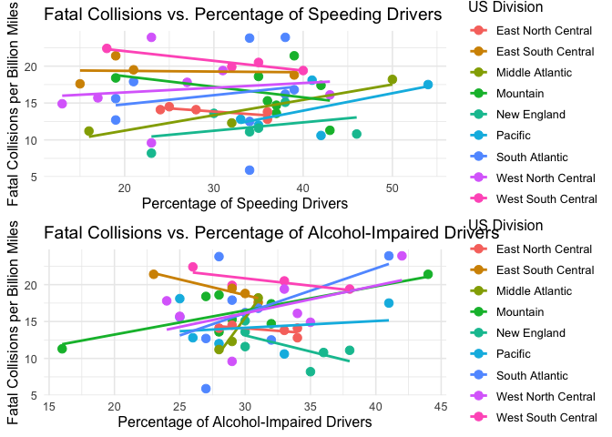
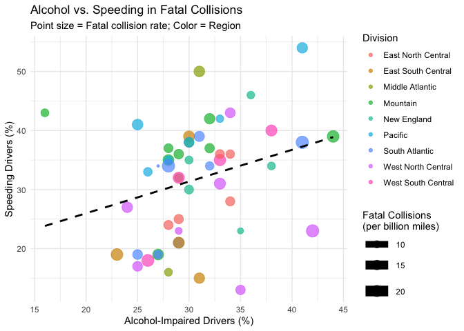

# Analysis on Bad Drivers in the United States

#### Eitan Tuchin, Tirmidi Mohamed

## Introduction

The goal of our project is to explore data about bad drivers in the
United States so that we can better understand causes of fatal car
crashes and point out common characteristics about bad drivers. Since
driving is such a common activity that we as humans do on a day-to-day
basis it becomes imperative to analyze times at when driving has gone
wrong in the name of trying to reduce the risk for these dangerous
situations. We hope that our exploration and the analysis of the data we
looked at will lead to more effective driving policies throughout
America and an altogether smaller fatalities reported in later data.

To achieve our project’s goal we will answer the following questions:

1.  Can we identify regional patterns in bad driving behaviors like
    speeding and alcohol impairment, and how do these align with fatal
    collision rates?

2.  Are there states where the percentage of speeding-related fatal
    collisions significantly deviates from the national average, and
    what state-specific factors might explain this?

3.  How well can a predictive model use percentages of speeding, alcohol
    impairment, and distraction to estimate fatal collisions per billion
    miles, and which factor is most influential?

These will be the main questions that we try and answer throughout our
work on this project. We hope to get to some meaningful conclusions
about bad drivers and their common trends in the United States.

## Data

### Structure

The link to our dataset is
<https://github.com/fivethirtyeight/data/blob/master/bad-drivers/bad-drivers.csv>.
The github link points to a csv file under a repository. Our dataset
contains varying statistics relating to specifically bad-drivers
throughout the United States including the District of Columbia. For
each state (row) there are 7 columns that contain statistics like
percentage of drivers involved in fatal collisions who were impaired by
alcohol use. Each metric is numerical, either being an int or a float.
Most deal with the “number of” or “percentage of” drivers in that state.

Overall our dataset is pretty simple and it contains all of the data we
need for answering our questions.

### Cleaning

The first thing we need to do is read in the csv file and take a look at
it:

``` r
data <- read.csv("bad-drivers.csv")
summary(data)
```

    ##     State          
    ##  Length:51         
    ##  Class :character  
    ##  Mode  :character  
    ##                    
    ##                    
    ##                    
    ##  Number.of.drivers.involved.in.fatal.collisions.per.billion.miles
    ##  Min.   : 5.90                                                   
    ##  1st Qu.:12.75                                                   
    ##  Median :15.60                                                   
    ##  Mean   :15.79                                                   
    ##  3rd Qu.:18.50                                                   
    ##  Max.   :23.90                                                   
    ##  Percentage.Of.Drivers.Involved.In.Fatal.Collisions.Who.Were.Speeding
    ##  Min.   :13.00                                                       
    ##  1st Qu.:23.00                                                       
    ##  Median :34.00                                                       
    ##  Mean   :31.73                                                       
    ##  3rd Qu.:38.00                                                       
    ##  Max.   :54.00                                                       
    ##  Percentage.Of.Drivers.Involved.In.Fatal.Collisions.Who.Were.Alcohol.Impaired
    ##  Min.   :16.00                                                               
    ##  1st Qu.:28.00                                                               
    ##  Median :30.00                                                               
    ##  Mean   :30.69                                                               
    ##  3rd Qu.:33.00                                                               
    ##  Max.   :44.00                                                               
    ##  Percentage.Of.Drivers.Involved.In.Fatal.Collisions.Who.Were.Not.Distracted
    ##  Min.   : 10.00                                                            
    ##  1st Qu.: 83.00                                                            
    ##  Median : 88.00                                                            
    ##  Mean   : 85.92                                                            
    ##  3rd Qu.: 95.00                                                            
    ##  Max.   :100.00                                                            
    ##  Percentage.Of.Drivers.Involved.In.Fatal.Collisions.Who.Had.Not.Been.Involved.In.Any.Previous.Accidents
    ##  Min.   : 76.00                                                                                        
    ##  1st Qu.: 83.50                                                                                        
    ##  Median : 88.00                                                                                        
    ##  Mean   : 88.73                                                                                        
    ##  3rd Qu.: 95.00                                                                                        
    ##  Max.   :100.00                                                                                        
    ##  Car.Insurance.Premiums....
    ##  Min.   : 642.0            
    ##  1st Qu.: 768.4            
    ##  Median : 859.0            
    ##  Mean   : 887.0            
    ##  3rd Qu.:1007.9            
    ##  Max.   :1301.5            
    ##  Losses.incurred.by.insurance.companies.for.collisions.per.insured.driver....
    ##  Min.   : 82.75                                                              
    ##  1st Qu.:114.64                                                              
    ##  Median :136.05                                                              
    ##  Mean   :134.49                                                              
    ##  3rd Qu.:151.87                                                              
    ##  Max.   :194.78

``` r
head(data)
```

    ##        State Number.of.drivers.involved.in.fatal.collisions.per.billion.miles
    ## 1    Alabama                                                             18.8
    ## 2     Alaska                                                             18.1
    ## 3    Arizona                                                             18.6
    ## 4   Arkansas                                                             22.4
    ## 5 California                                                             12.0
    ## 6   Colorado                                                             13.6
    ##   Percentage.Of.Drivers.Involved.In.Fatal.Collisions.Who.Were.Speeding
    ## 1                                                                   39
    ## 2                                                                   41
    ## 3                                                                   35
    ## 4                                                                   18
    ## 5                                                                   35
    ## 6                                                                   37
    ##   Percentage.Of.Drivers.Involved.In.Fatal.Collisions.Who.Were.Alcohol.Impaired
    ## 1                                                                           30
    ## 2                                                                           25
    ## 3                                                                           28
    ## 4                                                                           26
    ## 5                                                                           28
    ## 6                                                                           28
    ##   Percentage.Of.Drivers.Involved.In.Fatal.Collisions.Who.Were.Not.Distracted
    ## 1                                                                         96
    ## 2                                                                         90
    ## 3                                                                         84
    ## 4                                                                         94
    ## 5                                                                         91
    ## 6                                                                         79
    ##   Percentage.Of.Drivers.Involved.In.Fatal.Collisions.Who.Had.Not.Been.Involved.In.Any.Previous.Accidents
    ## 1                                                                                                     80
    ## 2                                                                                                     94
    ## 3                                                                                                     96
    ## 4                                                                                                     95
    ## 5                                                                                                     89
    ## 6                                                                                                     95
    ##   Car.Insurance.Premiums....
    ## 1                     784.55
    ## 2                    1053.48
    ## 3                     899.47
    ## 4                     827.34
    ## 5                     878.41
    ## 6                     835.50
    ##   Losses.incurred.by.insurance.companies.for.collisions.per.insured.driver....
    ## 1                                                                       145.08
    ## 2                                                                       133.93
    ## 3                                                                       110.35
    ## 4                                                                       142.39
    ## 5                                                                       165.63
    ## 6                                                                       139.91

The first thing we did cleaning wise was check for missing values in our
data by iterating over every column in our data and checking if the
value was NA or not. Then we removed any columns with missing values.

``` r
missing_values <- colSums(is.na(data))
print("Missing values per column:")
```

    ## [1] "Missing values per column:"

``` r
print(missing_values)
```

    ##                                                                                                  State 
    ##                                                                                                      0 
    ##                                       Number.of.drivers.involved.in.fatal.collisions.per.billion.miles 
    ##                                                                                                      0 
    ##                                   Percentage.Of.Drivers.Involved.In.Fatal.Collisions.Who.Were.Speeding 
    ##                                                                                                      0 
    ##                           Percentage.Of.Drivers.Involved.In.Fatal.Collisions.Who.Were.Alcohol.Impaired 
    ##                                                                                                      0 
    ##                             Percentage.Of.Drivers.Involved.In.Fatal.Collisions.Who.Were.Not.Distracted 
    ##                                                                                                      0 
    ## Percentage.Of.Drivers.Involved.In.Fatal.Collisions.Who.Had.Not.Been.Involved.In.Any.Previous.Accidents 
    ##                                                                                                      0 
    ##                                                                             Car.Insurance.Premiums.... 
    ##                                                                                                      0 
    ##                           Losses.incurred.by.insurance.companies.for.collisions.per.insured.driver.... 
    ##                                                                                                      0

``` r
data <- data[, colSums(is.na(data)) == 0]  
print("Columns after removing those with NAs:")
```

    ## [1] "Columns after removing those with NAs:"

``` r
print(names(data))
```

    ## [1] "State"                                                                                                 
    ## [2] "Number.of.drivers.involved.in.fatal.collisions.per.billion.miles"                                      
    ## [3] "Percentage.Of.Drivers.Involved.In.Fatal.Collisions.Who.Were.Speeding"                                  
    ## [4] "Percentage.Of.Drivers.Involved.In.Fatal.Collisions.Who.Were.Alcohol.Impaired"                          
    ## [5] "Percentage.Of.Drivers.Involved.In.Fatal.Collisions.Who.Were.Not.Distracted"                            
    ## [6] "Percentage.Of.Drivers.Involved.In.Fatal.Collisions.Who.Had.Not.Been.Involved.In.Any.Previous.Accidents"
    ## [7] "Car.Insurance.Premiums...."                                                                            
    ## [8] "Losses.incurred.by.insurance.companies.for.collisions.per.insured.driver...."

Then, for simplicity sake, we wanted to rename some of the columns in
our data because they weren’t as data explorable and accessible
friendly. For example, we have a column named “Number of drivers
involved in fatal collisions per billion miles” which would be annoying
to access since it’s separated by white-space and very long. We also
checked to see if we got the intended result.

``` r
colnames(data) <- c("State", "Fatal_Collisions_Per_Billion", "Percent_Speeding", 
                    "Percent_Alcohol", "Percent_Not_Distracted", "Percent_No_Prior", 
                    "Insurance_Premiums", "Losses_Per_Driver")
str(data)
```

    ## 'data.frame':    51 obs. of  8 variables:
    ##  $ State                       : chr  "Alabama" "Alaska" "Arizona" "Arkansas" ...
    ##  $ Fatal_Collisions_Per_Billion: num  18.8 18.1 18.6 22.4 12 13.6 10.8 16.2 5.9 17.9 ...
    ##  $ Percent_Speeding            : int  39 41 35 18 35 37 46 38 34 21 ...
    ##  $ Percent_Alcohol             : int  30 25 28 26 28 28 36 30 27 29 ...
    ##  $ Percent_Not_Distracted      : int  96 90 84 94 91 79 87 87 100 92 ...
    ##  $ Percent_No_Prior            : int  80 94 96 95 89 95 82 99 100 94 ...
    ##  $ Insurance_Premiums          : num  785 1053 899 827 878 ...
    ##  $ Losses_Per_Driver           : num  145 134 110 142 166 ...

Since we are going to be doing some statistical modeling later to answer
our question we decided to turn the State column into a factor type from
a String. Then we grabbed all the columns that contained numeric data
and stored them. We then ensured that these specified columns are
treated as numbers and not anything else. Now we have easy data to work
with.

``` r
data$State <- as.factor(data$State)
numeric_cols <- c("Fatal_Collisions_Per_Billion", "Percent_Speeding", "Percent_Alcohol", 
                  "Percent_Not_Distracted", "Percent_No_Prior", "Insurance_Premiums", 
                  "Losses_Per_Driver")
data[numeric_cols] <- lapply(data[numeric_cols], as.numeric)
```

Lastly, we need to check if we have any duplicate rows in our data. Then
we removed those rows from the data.

``` r
duplicates <- duplicated(data)
print("Number of duplicate rows:")
```

    ## [1] "Number of duplicate rows:"

``` r
print(sum(duplicates))
```

    ## [1] 0

``` r
data <- data[!duplicates, ]  

print("Final cleaned data:")
```

    ## [1] "Final cleaned data:"

``` r
head(data)
```

    ##        State Fatal_Collisions_Per_Billion Percent_Speeding Percent_Alcohol
    ## 1    Alabama                         18.8               39              30
    ## 2     Alaska                         18.1               41              25
    ## 3    Arizona                         18.6               35              28
    ## 4   Arkansas                         22.4               18              26
    ## 5 California                         12.0               35              28
    ## 6   Colorado                         13.6               37              28
    ##   Percent_Not_Distracted Percent_No_Prior Insurance_Premiums Losses_Per_Driver
    ## 1                     96               80             784.55            145.08
    ## 2                     90               94            1053.48            133.93
    ## 3                     84               96             899.47            110.35
    ## 4                     94               95             827.34            142.39
    ## 5                     91               89             878.41            165.63
    ## 6                     79               95             835.50            139.91

After cleaning our data it’s ready to be analyzed and interpreted.

### Variables

Here we list all of the variables (columns) in our dataset:

- State - The state to which the statistics in the row are attributed
  to.
- Fatal_Collisions_Per_Billion - Number of drivers involved in fatal
  collisions per billion miles.
- Percent_Speeding - Percentage of drivers who were involved in fatal
  collisions who were speeding.
- Percent_Alcohol - Percentage of drivers who were involved in fatal
  collisions who were alcohol-impaired.
- Percent_Not_Distracted - Percentage of drivers who were involved in
  fatal collisions who were not distracted.
- Percent_No_Prior - Percentage of drivers who were involved in fatal
  collisions who had not been in any previous accidents
- Insurance_Premiums - Average cost of car insurance premiums in that
  state.
- Losses_Per_Driver - Losses incurred by insurance companies for
  collisions per insured driver.

## Results

``` r
library(tidyverse)
```

    ## ── Attaching core tidyverse packages ──────────────────────── tidyverse 2.0.0 ──
    ## ✔ dplyr     1.1.4     ✔ readr     2.1.5
    ## ✔ forcats   1.0.0     ✔ stringr   1.5.1
    ## ✔ ggplot2   3.5.1     ✔ tibble    3.2.1
    ## ✔ lubridate 1.9.4     ✔ tidyr     1.3.1
    ## ✔ purrr     1.0.4     
    ## ── Conflicts ────────────────────────────────────────── tidyverse_conflicts() ──
    ## ✖ dplyr::filter() masks stats::filter()
    ## ✖ dplyr::lag()    masks stats::lag()
    ## ℹ Use the conflicted package (<http://conflicted.r-lib.org/>) to force all conflicts to become errors

``` r
library(ggplot2)
library(dplyr)
library(tidyr)
library(reshape2)
```

    ## 
    ## Attaching package: 'reshape2'
    ## 
    ## The following object is masked from 'package:tidyr':
    ## 
    ##     smiths

### Can we identify regional patterns in bad driving behaviors like speeding and alcohol impairment, and how do these align with fatal collision rates?

``` r
divisions <- list(
  `New England` = c("Connecticut", "Maine", "Massachusetts", "New Hampshire", "Rhode Island", "Vermont"),
  `Middle Atlantic` = c("New Jersey", "New York", "Pennsylvania"),
  `East North Central` = c("Illinois", "Indiana", "Michigan", "Ohio", "Wisconsin"),
  `West North Central` = c("Iowa", "Kansas", "Minnesota", "Missouri", "Nebraska", "North Dakota", "South Dakota"),
  `South Atlantic` = c("Delaware", "Florida", "Georgia", "Maryland", "North Carolina", "South Carolina", 
                      "Virginia", "West Virginia", "District of Columbia"),
  `East South Central` = c("Alabama", "Kentucky", "Mississippi", "Tennessee"),
  `West South Central` = c("Arkansas", "Louisiana", "Oklahoma", "Texas"),
  `Mountain` = c("Arizona", "Colorado", "Idaho", "Montana", "Nevada", "New Mexico", "Utah", "Wyoming"),
  `Pacific` = c("Alaska", "California", "Hawaii", "Oregon", "Washington")
)

data <- data %>%
  mutate(Division = case_when(
    State %in% divisions$`New England` ~ "New England",
    State %in% divisions$`Middle Atlantic` ~ "Middle Atlantic",
    State %in% divisions$`East North Central` ~ "East North Central",
    State %in% divisions$`West North Central` ~ "West North Central",
    State %in% divisions$`South Atlantic` ~ "South Atlantic",
    State %in% divisions$`East South Central` ~ "East South Central",
    State %in% divisions$`West South Central` ~ "West South Central",
    State %in% divisions$`Mountain` ~ "Mountain",
    State %in% divisions$`Pacific` ~ "Pacific",
    TRUE ~ NA_character_
  ))

division_summary <- data %>%
  group_by(Division) %>%
  summarise(
    Avg_Percent_Speeding = mean(Percent_Speeding, na.rm = TRUE),
    Avg_Percent_Alcohol = mean(Percent_Alcohol, na.rm = TRUE),
    Avg_Fatal_Collisions = mean(Fatal_Collisions_Per_Billion, na.rm = TRUE)
  )

print("Division Summary:")
```

    ## [1] "Division Summary:"

``` r
print(division_summary)
```

    ## # A tibble: 9 × 4
    ##   Division         Avg_Percent_Speeding Avg_Percent_Alcohol Avg_Fatal_Collisions
    ##   <chr>                           <dbl>               <dbl>                <dbl>
    ## 1 East North Cent…                 29.8                31.6                 13.9
    ## 2 East South Cent…                 23.5                28.2                 19.3
    ## 3 Middle Atlantic                  32.7                29.3                 13.9
    ## 4 Mountain                         36                  29.5                 16.3
    ## 5 New England                      34.3                33.2                 11.7
    ## 6 Pacific                          41                  30.6                 14.2
    ## 7 South Atlantic                   30.7                30                   16.1
    ## 8 West North Cent…                 25.3                31.7                 16.8
    ## 9 West South Cent…                 31.2                31.5                 20.5

``` r
# Reshape data for heatmap
heatmap_data <- division_summary %>%
  select(Division, Avg_Percent_Speeding, Avg_Percent_Alcohol, Avg_Fatal_Collisions) %>%
  melt(id.vars = "Division")

# Plot
ggplot(heatmap_data, aes(x = variable, y = Division, fill = value)) +
  geom_tile(color = "white") +
  scale_fill_gradient(low = "lightyellow", high = "red", name = "Average Value") +
  labs(
    title = "Regional Patterns: Speeding, Alcohol, and Fatal Collisions",
    subtitle = "Darker shades indicate higher values",
    x = "Metric",
    y = "Region"
  ) +
  theme_minimal() +
  theme(axis.text.x = element_text(angle = 45, hjust = 1))
```

<!-- -->

``` r
ggplot(data, aes(x = Percent_Alcohol, y = Percent_Speeding, 
                 size = Fatal_Collisions_Per_Billion, color = Division)) +
  geom_point(alpha = 0.7) +
  geom_smooth(method = "lm", se = FALSE, color = "black", linetype = "dashed") +
  scale_size_continuous(name = "Fatal Collisions\n(per billion miles)") +
  labs(
    title = "Alcohol vs. Speeding in Fatal Collisions",
    subtitle = "Point size = Fatal collision rate; Color = Region",
    x = "Alcohol-Impaired Drivers (%)",
    y = "Speeding Drivers (%)"
  ) +
  theme_minimal()
```

    ## Warning: Using `size` aesthetic for lines was deprecated in ggplot2 3.4.0.
    ## ℹ Please use `linewidth` instead.
    ## This warning is displayed once every 8 hours.
    ## Call `lifecycle::last_lifecycle_warnings()` to see where this warning was
    ## generated.

    ## `geom_smooth()` using formula = 'y ~ x'

    ## Warning: The following aesthetics were dropped during statistical transformation: size.
    ## ℹ This can happen when ggplot fails to infer the correct grouping structure in
    ##   the data.
    ## ℹ Did you forget to specify a `group` aesthetic or to convert a numerical
    ##   variable into a factor?

<!-- -->

### Are there states where the percentage of speeding-related fatal collisions significantly deviates from the national average, and what state-specific factors (e.g., speed limits, road conditions) might explain this?

### How well can a predictive model (e.g., linear regression) use percentages of speeding, alcohol impairment, and distraction to estimate fatal collisions per billion miles, and which factor is most influential?

## Conclusion
